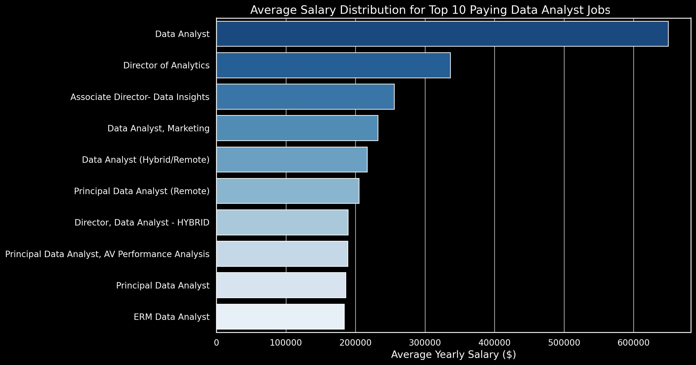
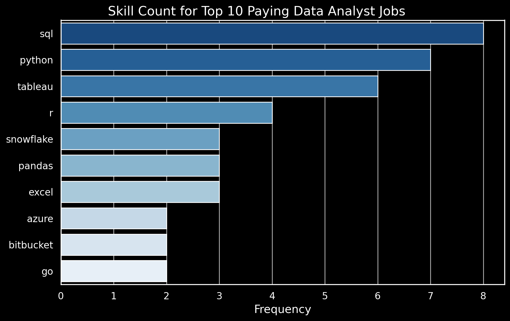

# $Introduction$
📊 Dive into the data job market! Focusing on data analyst roles, this project explores 💰 top-paying jobs, 🔥 in-demand skills, and 📈 where high demand meets high salary in data analytics.

🔍 SQL queries? Check them out here: [project_sql] (/project_sql/)

## 1. Top Paying Data Analyst Jobs
To identify the highest-paying roles, I filtered data analyst positions by average yearly salary and location, focusing on remote jobs. This query highlights the high paying opportunities in the field.

```sql
SELECT
        JOB_ID
        , JOB_TITLE
        , JOB_COUNTRY
        , JOB_SCHEDULE_TYPE
        , SALARY_YEAR_AVG
        , NAME AS COMPANY_NAME
FROM
        JOB_POSTINGS_FACT JOB
JOIN    COMPANY_DIM COMP
        ON JOB.COMPANY_ID = COMP.COMPANY_ID
WHERE   
        JOB_TITLE_SHORT = 'Data Analyst'
        AND SALARY_YEAR_AVG IS NOT NULL
        AND JOB_LOCATION = 'Anywhere'           -- ONLY REMOTE JOBS
ORDER BY
        SALARY_YEAR_AVG DESC
LIMIT 10;

```
Here's the breakdown of the top data analyst jobs:
- **Wide Salary Range:** Top 10 paying data analyst roles span from $184,000 to $650,000, indicating significant salary potential in the field.
- **Diverse Employers:** Companies like SmartAsset, Meta, and AT&T are among those offering high salaries, showing a broad interest across different industries.
- **Job Title Variety:** There's a high diversity in job titles, from Data Analyst to Director of Analytics, reflecting varied roles and specializations within data analytics.


*Bar graph visualizing the salary for the top 10 salaries for data analysts; ChatGPT generated this graph from my SQL query results*


## 2. Skills for Top Paying Jobs
To understand what skills are required for the top-paying jobs, I joined the job postings with the skills data, providing insights into what employers value for high-compensation roles.

```SQL
WITH TOP_PAYING_JOBS AS
(
    SELECT
            JOB_ID
            , JOB_TITLE
            , JOB_COUNTRY
            , JOB_SCHEDULE_TYPE
            , SALARY_YEAR_AVG
            , NAME AS COMPANY_NAME
    FROM
            JOB_POSTINGS_FACT JOB
    JOIN    COMPANY_DIM COMP
            ON JOB.COMPANY_ID = COMP.COMPANY_ID
    WHERE   
            JOB_TITLE_SHORT = 'Data Analyst'
            AND SALARY_YEAR_AVG IS NOT NULL
            AND JOB_LOCATION = 'Anywhere'           -- ONLY REMOTE JOBS
    ORDER BY
            SALARY_YEAR_AVG DESC
    LIMIT 10 
)
SELECT  TOP_PAYING_JOBS.*
        , COALESCE(SKILLS,'NO SKILL INFO AVAIABLE')
FROM    TOP_PAYING_JOBS
LEFT JOIN SKILLS_JOB_DIM AS SILLS_JOB ON  SILLS_JOB.JOB_ID = TOP_PAYING_JOBS.JOB_ID
LEFT JOIN SKILLS_DIM AS SKILLS ON  SKILLS.SKILL_ID = SILLS_JOB.SKILL_ID
ORDER BY
          SALARY_YEAR_AVG DESC
        , SKILLS ;
```
Here's the breakdown of the most demanded skills for the top 10 highest paying data analyst jobs 
- **SQL** is leading with a bold count of 8.
- **Python** follows closely with a bold count of 7.
- **Tableau** is also highly sought after, with a bold count of 6.
Other skills like **R**, **Snowflake**, **Pandas**, and **Excel** show varying degrees of demand.


*Bar graph visualizing the count of skills for the top 10 paying jobs for data analysts; ChatGPT generated this graph from my SQL query results*


## 3. In-Demand Skills
This query helped identify the skills most frequently requested in job postings, directing focus to areas with high demand.

```sql
SELECT 
        SKILLS  SKILL_NAME
        , COUNT(SKILLS_JOB.SKILL_ID) SKILL_COUNT
FROM    
        SKILLS_JOB_DIM  SKILLS_JOB
JOIN    
        SKILLS_DIM AS SKILLS 
    ON  SKILLS.SKILL_ID = SKILLS_JOB.SKILL_ID
JOIN    JOB_POSTINGS_FACT AS JOB 
    ON  JOB.JOB_ID = SKILLS_JOB.JOB_ID
WHERE   
        JOB_TITLE_SHORT = 'Data Analyst'
GROUP BY
        SKILLS.SKILLS
ORDER BY 
        SKILL_COUNT DESC
LIMIT   5 ;
```
*Output*

| Skill Name | Skill Count |
|------------|-------------|
| SQL        | 92,628      |
| Excel      | 67,031      |
| Python     | 57,326      |
| Tableau    | 46,554      |
| Power BI   | 39,468      |


## 4. Top Salaied Skills
Exploring the average salaries associated with different skills revealed which skills are the highest paying.

``` SQL 
SELECT
        SKILLS
        , ROUND(AVG(SALARY_YEAR_AVG)) AVG_SALARY
FROM
        JOB_POSTINGS_FACT   JP
JOIN    SKILLS_JOB_DIM      SJ  ON SJ.JOB_ID = JP.JOB_ID
JOIN    SKILLS_DIM          S   ON S.SKILL_ID = SJ.SKILL_ID
WHERE   1=1
AND     SALARY_YEAR_AVG     IS NOT NULL
AND     JOB_TITLE_SHORT     = 'Data Analyst'
--    AND JOB_WORK_FROM_HOME  = TRUE
GROUP BY SKILLS
ORDER BY AVG_SALARY     DESC
LIMIT 50;
```

| Skills        | Average Salary ($) |
|---------------|-------------------:|
| pyspark       |            208,172 |
| bitbucket     |            189,155 |
| couchbase     |            160,515 |
| watson        |            160,515 |
| datarobot     |            155,486 |
| gitlab        |            154,500 |
| swift         |            153,750 |
| jupyter       |            152,777 |
| pandas        |            151,821 |
| elasticsearch |            145,000 |

*Table of the average salary for the top 10 paying skills for data analysts*

## 5. Most Optimal Skills to Learn
### SQL Using CTE Method
``` SQL


WITH SKILLS_DEMAND AS (
    SELECT
            S.SKILL_ID
            , S.SKILLS
            , COUNT(SJ.JOB_ID) JOB_DEMAND
    FROM
            JOB_POSTINGS_FACT JPF
    JOIN    SKILLS_JOB_DIM  SJ ON SJ.JOB_ID = JPF.job_id
    JOIN    SKILLS_DIM S ON S.SKILL_ID = SJ.SKILL_ID
    WHERE   1=1
    AND     SALARY_YEAR_AVG     IS NOT NULL
    AND     JOB_TITLE_SHORT     = 'Data Analyst'
    AND     JOB_WORK_FROM_HOME  = TRUE
    GROUP BY
            S.SKILL_ID
),

AVG_SALARY AS (
    SELECT
            S.SKILL_ID
            , ROUND(AVG(SALARY_YEAR_AVG)) AVG_SALARY
    FROM
            JOB_POSTINGS_FACT   JP
    JOIN    SKILLS_JOB_DIM      SJ  ON SJ.JOB_ID = JP.JOB_ID
    JOIN    SKILLS_DIM          S   ON S.SKILL_ID = SJ.SKILL_ID
    WHERE   1=1
    AND     SALARY_YEAR_AVG     IS NOT NULL
    AND     JOB_TITLE_SHORT     = 'Data Analyst'
    AND     JOB_WORK_FROM_HOME  = TRUE
    GROUP BY 
            S.SKILL_ID
)

SELECT  DISTINCT
        D.SKILL_ID         "Skill Id"
        , D.SKILLS         "Skill Name"
        , D.JOB_DEMAND     "Number of Jobs "
        , SAL.AVG_SALARY   "Avg Salary"
FROM 
        SKILLS_DEMAND D
JOIN    
        AVG_SALARY SAL  ON SAL.SKILL_ID = D.SKILL_ID
WHERE   
        D.JOB_DEMAND > 10
ORDER BY
        JOB_DEMAND DESC
        , AVG_SALARY DESC
LIMIT   
        25
;
```

### SQL Using Direct Joins

``` SQL
SELECT
        S.SKILL_ID "Skill Id"
        , S.SKILLS "Skill Name"
        , COUNT(SK.JOB_ID) "Job Count"
        , ROUND(AVG(J.SALARY_YEAR_AVG)) "AVG Salary"        
FROM
        JOB_POSTINGS_FACT   J
JOIN    SKILLS_JOB_DIM  SK ON SK.JOB_ID = J.JOB_ID
JOIN    SKILLS_DIM  S ON S.SKILL_ID = SK.SKILL_ID
WHERE   1=1
AND     J.JOB_TITLE_SHORT = 'Data Analyst'
AND     J.JOB_WORK_FROM_HOME = TRUE
AND     J.SALARY_YEAR_AVG IS NOT NULL
GROUP BY
        S.SKILL_ID
HAVING 
        COUNT(SK.JOB_ID) > 10
ORDER BY
        "Job Count" DESC
        , "AVG Salary" DESC
        
LIMIT
        25;
```
| Skill Id | Skill Name | Job Count | AVG Salary |
|----------|------------|-----------|------------|
| 0        | SQL        | 398       | 97,237     |
| 181      | Excel      | 256       | 87,288     |
| 1        | Python     | 236       | 101,397    |
| 182      | Tableau    | 230       | 99,288     |
| 5        | R          | 148       | 100,499    |
| 183      | Power BI   | 110       | 97,431     |
| 7        | SAS        | 63        | 98,902     |
| 186      | SAS        | 63        | 98,902     |
| 196      | PowerPoint | 58        | 88,701     |
| 185      | Looker     | 49        | 103,795    |

* Table of the most optimal skills for data analyst sorted by salary*


# Conclusions

### Insights
From the analysis, several general insights emerged:

1. **Top-Paying Data Analyst Jobs**: The highest-paying jobs for data analysts that allow remote work offer a wide range of salaries, the highest at $650,000!
2. **Skills for Top-Paying Jobs**: High-paying data analyst jobs require advanced proficiency in SQL, suggesting it’s a critical skill for earning a top salary.
3. **Most In-Demand Skills**: SQL is also the most demanded skill in the data analyst job market, thus making it essential for job seekers.
4. **Skills with Higher Salaries**: Specialized skills, such as SVN and Solidity, are associated with the highest average salaries, indicating a premium on niche expertise.
5. **Optimal Skills for Job Market Value**: SQL leads in demand and offers for a high average salary, positioning it as one of the most optimal skills for data analysts to learn to maximize their market value.

### Closing Thoughts
The findings from the analysis serve as a guide to prioritizing skill development and job search efforts. Aspiring data analysts can better position themselves in a competitive job market by focusing on high-demand, high-salary skills. This exploration highlights the importance of continuous learning and adaptation to emerging trends in the field of data analytics.

Note: The analysis was performed on real-time job market data, ensuring that the insights reflect current industry demands and salary trends.